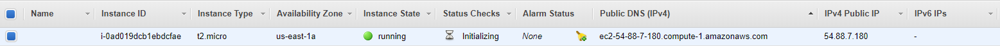
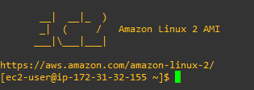
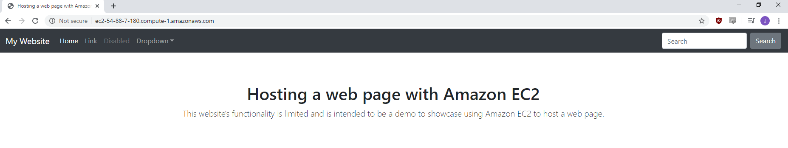
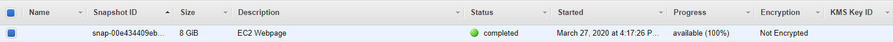
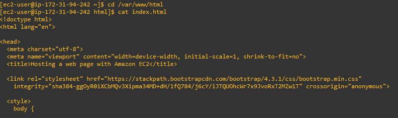
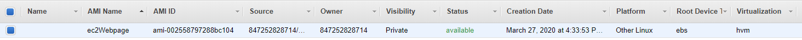
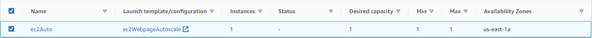
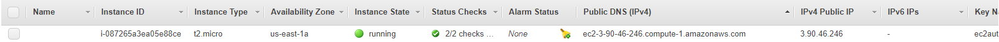

# AWS
Learning AWS through various projects
---------------------------------------

Setting up billing alerts: 

Configuring IAM user for personal use: 

Deploy an EC2 instance & configure it as a web server to host a web page: 

Now with the EC2 instance launched, I am going to use it to host a simple web page that I created:

To accomplish this, I started out by connecting to the EC2 instance and issuing an update (sudo yum update). Next, I installed an HTTP server (sudo yum install httpd -y). Once this was installed, I created an index.html file (touch index.html) within /var/www/html (cd /var/www/html) and edited the file with nano (sudo nano index.html). After putting the HTML code in the file, I started the httpd service with (service httpd start). The result is a working webpage hosted on Amazon EC2: 

Creating a snapshot of the EC2 instance & deploying a new EC2 instance using the snapshot: 

The snapshot was created successfully, now to launch the EC2 instance using the snapshot I created: 

Let's verify that the snapshot works and we have the webpage installed: 

Creating an AMI using that EC2 instance: 

Putting that AMI in an autoscaling group so that one VM always exists: 

Let's verify that the autoscaling group is working: 

Next, creating an Elastic Load Balancer 
