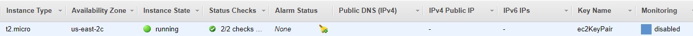
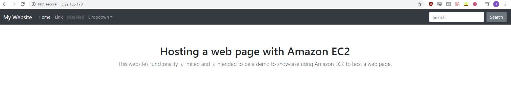

# Creating a VPC
```
aws ec2 create-vpc --cidr-block 10.0.0.0/16
```
Output:
```
Vpc:
  CidrBlock: 10.0.0.0/16
  CidrBlockAssociationSet:
  - AssociationId: *****
    CidrBlock: 10.0.0.0/16
    CidrBlockState:
      State: associated
  DhcpOptionsId: *****
  InstanceTenancy: default
  Ipv6CidrBlockAssociationSet: []
  IsDefault: false
  OwnerId: *****
  State: pending
  VpcId: *****
```

# Creating a Subnet
```
aws ec2 create-subnet --vpc-id vpc-0fa99d2c78c8b89e0 --cidr-block 10.0.1.0/24
```
Output:
```
Subnet:
  AssignIpv6AddressOnCreation: false
  AvailabilityZone: us-east-2c
  AvailabilityZoneId: use2-az3
  AvailableIpAddressCount: 251
  CidrBlock: 10.0.1.0/24
  DefaultForAz: false
  Ipv6CidrBlockAssociationSet: []
  MapPublicIpOnLaunch: false
  OwnerId: *****
  State: pending
  SubnetArn: *****
  SubnetId: *****
  VpcId: *****
  ```

# Creating a Security Group
```
aws ec2 create-security-group --group-name cliSecGroup --description "This security group was created from the AWS CLI." --vpc-id vpc-******
```
Output:
```
GroupId: sg-*****
```


Before I add an inbound SSH rule, I'm going to check my IP address with:
```
curl https://checkip.amazonaws.com
```

Adding an inbound SSH rule:
```
$ aws ec2 authorize-security-group-ingress --group-id sg-0f6d5a085ce62497b --protocol tcp --port 22 --cidr 'your_ip'
```

# Creating a Key Pair
```
aws ec2 create-key-pair --key-name ec2KeyPair --query 'KeyMaterial' --output text | out-file -encoding ascii -filepath ec2KeyPair.pem
```

# Creating an Internet Gateway
```
aws ec2 create-internet-gateway
```

# Attaching Internet Gateway to VPC
```
aws ec2 attach-internet-gateway --internet-gateway-id igw-***** --vpc-id vpc-*****
```

# Creating Route Table
```
aws ec2 create-route-table --vpc-id vpc-*****
```

# Creating a Route
```
aws ec2 create-route --route-table-id rtb-***** --destination-cidr-block 0.0.0.0/0 --gateway-id igw-*****
```

# Associating the Route with a Subnet
```
aws ec2 associate-route-table --route-table-id rtb-***** --subnet-id subnet-*****
```
Output:
```
AssociationId: rtbassoc-*****
AssociationState:
  State: associated
```

# Deploying an EC2 instance
Deploying a Amazon Linux 2 t2.micro ec2 instance with an automatically assigned public ip address:
```
aws ec2 run-instances --image-id ami-0f7919c33c90f5b58 --count 1 --instance-type t2.micro --key-name ec2KeyPair --security-group-ids sg-***** --subnet-id subnet-***** --associate-public-ip-address
```
Output:
```
Groups: []
Instances:
- AmiLaunchIndex: 0
  Architecture: x86_64
  BlockDeviceMappings: []
  CapacityReservationSpecification:
    CapacityReservationPreference: open
  ClientToken: *****
  CpuOptions:
    CoreCount: 1
    ThreadsPerCore: 1
  EbsOptimized: false
  Hypervisor: xen
  ImageId: ami-*****
  InstanceId: i-*****
  InstanceType: t2.micro
  KeyName: ec2KeyPair
  LaunchTime: '2020-05-25T00:05:16+00:00'
  MetadataOptions:
    HttpEndpoint: enabled
    HttpPutResponseHopLimit: 1
    HttpTokens: optional
    State: pending
  Monitoring:
    State: disabled
  NetworkInterfaces:
  - Attachment:
      AttachTime: '2020-05-25T00:05:16+00:00'
      AttachmentId: eni-attach-*****
      DeleteOnTermination: true
      DeviceIndex: 0
      Status: attaching
    Description: ''
    Groups:
    - GroupId: sg-*****
      GroupName: cliSecGroup
    InterfaceType: interface
    Ipv6Addresses: []
    MacAddress: 0a:23:5c:3f:36:d8
    NetworkInterfaceId: eni-*****
    OwnerId: '847252828714'
    PrivateIpAddress: 10.0.1.77
    PrivateIpAddresses:
    - Primary: true
      PrivateIpAddress: 10.0.1.77
    SourceDestCheck: true
    Status: in-use
    SubnetId: subnet-*****
    VpcId: vpc-*****      
    Placement:         
    AvailabilityZone: us-east-2c
    GroupName: ''
    Tenancy: default
  PrivateDnsName: ip-10-0-1-77.us-east-2.compute.internal
  PrivateIpAddress: 10.0.1.77
  ProductCodes: []
  PublicDnsName: ''
  RootDeviceName: /dev/xvda
  RootDeviceType: ebs
  SecurityGroups:
  - GroupId: sg-*****
    GroupName: cliSecGroup
  SourceDestCheck: true
  State:
    Code: 0
    Name: pending
  StateReason:
    Code: pending
    Message: pending
  StateTransitionReason: ''
  SubnetId: subnet-*****
  VirtualizationType: hvm
  VpcId: vpc-*****
OwnerId: '*****'
ReservationId: r-*****
```
Verifing that an EC2 instance is launched by checking the AWS console: 

Additionally, you can list your ec2 instances to see if it actually launched:
```
aws ec2 describe-instances --filters "Name=instance-type,Values=t2.micro" --query "Reservations[].Instances[].InstanceId"
```
Output:
```
i-*****
```

# Connecting to the EC2 instance
I'm going to switch over to a Linux virtual machine that I created using Vagrant. For more information on Vagrant, click [here](https://github.com/jacobhaiges/Linux/blob/master/docs/02-setup.md). The Vagrantfile config that I'm using:
```
Vagrant.configure("2") do |config|

  config.vm.box = "centos/7"
  config.vm.network "public_network"

end
```


Once on the virtual machine, to connect to the EC2 instance:
```
ssh -i "ec2KeyPair.pem" ec2-user@'ip_address'
```
Update the machine:
```
sudo yum update
```
Install an HTTP server:
```
sudo yum install httpd -y
```
Changing directories to the default root folder of the web server:
```
cd /var/www/html
```
Creating an index.html file:
```
sudo touch index.html
```
Editing the index.html file using vim:
```
vim index.html
```
I created a sample [index.html](../index.html) file for this project:
```
<!doctype html>
<html lang="en">

<head>
  <meta charset="utf-8">
  <meta name="viewport" content="width=device-width, initial-scale=1, shrink-to-fit=no">
  <title>Hosting a web page with Amazon EC2</title>

  <link rel="stylesheet" href="https://stackpath.bootstrapcdn.com/bootstrap/4.3.1/css/bootstrap.min.css"
    integrity="sha384-ggOyR0iXCbMQv3Xipma34MD+dH/1fQ784/j6cY/iJTQUOhcWr7x9JvoRxT2MZw1T" crossorigin="anonymous">

  <style>
    body {
      padding-top: 5rem;
    }

    .starter-template {
      padding: 3rem 1.5rem;
      text-align: center;
    }

    .bd-placeholder-img {
      font-size: 1.125rem;
      text-anchor: middle;
      -webkit-user-select: none;
      -moz-user-select: none;
      -ms-user-select: none;
      user-select: none;
    }

    @media (min-width: 768px) {
      .bd-placeholder-img-lg {
        font-size: 3.5rem;
      }
    }

  </style>
</head>

<body>
  <nav class="navbar navbar-expand-md navbar-dark bg-dark fixed-top">
    <a class="navbar-brand" href="#">My Website</a>
    <button class="navbar-toggler" type="button" data-toggle="collapse" data-target="#navbarsExampleDefault"
      aria-controls="navbarsExampleDefault" aria-expanded="false" aria-label="Toggle navigation">
      <span class="navbar-toggler-icon"></span>
    </button>

    <div class="collapse navbar-collapse" id="navbarsExampleDefault">
      <ul class="navbar-nav mr-auto">
        <li class="nav-item active">
          <a class="nav-link" href="#">Home <span class="sr-only">(current)</span></a>
        </li>
        <li class="nav-item">
          <a class="nav-link" href="#">Link</a>
        </li>
        <li class="nav-item">
          <a class="nav-link disabled" href="#" tabindex="-1" aria-disabled="true">Disabled</a>
        </li>
        <li class="nav-item dropdown">
          <a class="nav-link dropdown-toggle" href="#" id="dropdown01" data-toggle="dropdown" aria-haspopup="true"
            aria-expanded="false">Dropdown</a>
          <div class="dropdown-menu" aria-labelledby="dropdown01">
            <a class="dropdown-item" href="#">Action</a>
            <a class="dropdown-item" href="#">Another action</a>
            <a class="dropdown-item" href="#">Something else here</a>
          </div>
        </li>
      </ul>
      <form class="form-inline my-2 my-lg-0">
        <input class="form-control mr-sm-2" type="text" placeholder="Search" aria-label="Search">
        <button class="btn btn-secondary my-2 my-sm-0" type="submit">Search</button>
      </form>
    </div>
  </nav>

  <main role="main" class="container">

    <div class="starter-template">
      <h1>Hosting a web page with Amazon EC2</h1>
      <p class="lead">This website's functionality is limited and is intended to be a demo to showcase using Amazon EC2 to host a web page.
      </p>
    </div>
```
Starting the httpd (web server) service:
```
sudo service httpd start
```
Switching over to Google Chrome and seeing if I can connect to the web page: 
