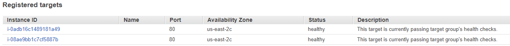
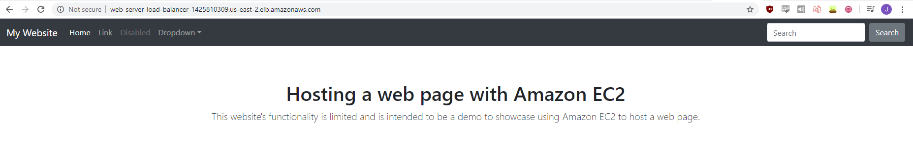

# Creating an Application Load Balancer
In order to create an application load balancer you must specify two subnets that aren't from the same availability zone.
```
aws elbv2 create-load-balancer --name web-server-load-balancer --subnets subnet-***** subnet-***** --security-groups sg-*****
```
Output:
```
LoadBalancers:
- AvailabilityZones:
  - LoadBalancerAddresses: []
    SubnetId: subnet-*****
    ZoneName: us-east-2c
  - LoadBalancerAddresses: []
    SubnetId: subnet-*****
    ZoneName: us-east-2a
  CanonicalHostedZoneId: *****
  CreatedTime: '2020-05-25T18:44:46.830000+00:00'
  DNSName: web-server-load-balancer-*****.us-east-2.elb.amazonaws.com
  IpAddressType: ipv4
  LoadBalancerArn: *****
  LoadBalancerName: web-server-load-balancer
  Scheme: internet-facing
  SecurityGroups:
  - sg-*****
  State:
    Code: provisioning
  Type: application
  VpcId: vpc-*****
  ```


You will need your subnet-id and the security-group-id for for this command.
To get the subnet-id:
```
aws ec2 describe-subnets
```
Output:
```
Subnets:
- AssignIpv6AddressOnCreation: false
  AvailabilityZone: us-east-2c
  AvailabilityZoneId: use2-az3
  AvailableIpAddressCount: 249
  CidrBlock: 10.0.1.0/24
  DefaultForAz: false
  Ipv6CidrBlockAssociationSet: []
  MapPublicIpOnLaunch: true
  OwnerId: '*****'
  State: available
  SubnetArn: ******
  SubnetId: subnet-*****
  VpcId: vpc-*****
```


To get the security-group-id:
```
aws ec2 describe-security-groups
```
And the information you're looking for in the output is the:
```
   GroupId: sg-*****
```


# Creating a Target Group
```
aws elbv2 create-target-group --name my-targets --protocol HTTP --port 80 --vpc-id vpc-*****
```
Output:
```
TargetGroups:
- HealthCheckEnabled: true
  HealthCheckIntervalSeconds: 30
  HealthCheckPath: /
  HealthCheckPort: traffic-port
  HealthCheckProtocol: HTTP
  HealthCheckTimeoutSeconds: 5
  HealthyThresholdCount: 5
  Matcher:
    HttpCode: '200'
  Port: 80
  Protocol: HTTP
  TargetGroupArn: *****
  TargetGroupName: my-targets
  TargetType: instance
  UnhealthyThresholdCount: 2
  VpcId: vpc-*****
```

# Registering Targets
To register a target you need the targetgroup-arn and the instance id.
```
aws elbv2 register-targets --target-group-arn arn:*****  --targets Id=i-***** Id=i-*****
```

# Creating a Listener
To create a listener you need the load balancer ARN, and the target group ARN.
```
aws elbv2 create-listener --load-balancer-arn arn:***** --protocol HTTP --port 80  --default-actions Type=forward,TargetGroupArn=arn:*****
```
Output:
```
Listeners:
- DefaultActions:
  - ForwardConfig:
      TargetGroupStickinessConfig:
        Enabled: false
      TargetGroups:
      - TargetGroupArn: arn:*****
        Weight: 1
    TargetGroupArn: arn:*****
    Type: forward
  ListenerArn: arn:*****
  LoadBalancerArn: arn:*****
  Port: 80
  Protocol: HTTP
```

# Verifying the health of the targets
To verify the health of a target, you need the targetgroup-arn.
```
aws elbv2 describe-target-health --target-group-arn targetgroup-arn
```
Output:
```
TargetHealthDescriptions:
- HealthCheckPort: '80'
  Target:
    Id: i-*****
    Port: 80
  TargetHealth:
    State: healthy
- HealthCheckPort: '80'
  Target:
    Id: i-*****
    Port: 80
  TargetHealth:
    State: healthy
```
From the console: 

# Connecting to the Load Balancer

To test if the load balancer was working correctly I tried to connect to the load balancer public DNS name. The load balancer is up and hosting the web page as intended: 
